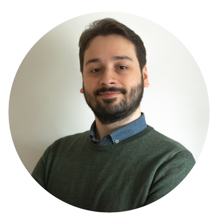
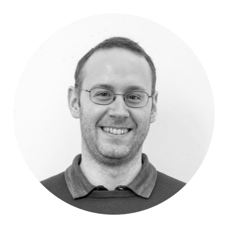

# First International Workshop on High Performance and Quantum Computing Integration (2024)

_Held in conjunction with the [33rd International Symposium on High-Performance Parallel and Distributed Computing](https://www.hpdc.org/2024/)_

High-performance computing (HPC) has witnessed significant milestones in its evolution, each wave of innovation breaking performance barriers and leading to groundbreaking scientific discoveries. As Quantum Computing (QC) matures, the question is no longer just about its theoretical capabilities, but also its applicability in real-world computing environments. Consequently, the HPC community is now turning its attention to the potential of QC as the next frontier in advancing the field.
However, for QC to realize its potential, it must be seamlessly integrated into the realm of high-performance computing. The integration of QC into HPC centers has become a topic of increasing interest and urgency. This workshop will focus on the actions needed to achieve this integration when addressing various layers, including programming models, environmental and infrastructure requirements, integrated scheduling environments, and operating system extensions. The degree of such integration into the various layers, whether it is very loose, where jobs are dispatched to remote schedulers in the cloud, or very, with direct physical connection to the control unit, will define the effort required by the interested actors.

## Program

*   Opening
*   Keynote: Speaker TBA
*   Invited Talk 1: Speaker TBA
*   Talks: Speaker TBA
*   Break
*   Invited Talk 2: Speaker TBA
*   Talks: Speaker TBA
*   Panel discussion
*   Ending Remarks

## Program Committee

  
  <i><b>Davide Ferrari</b>, PhD (University of Parma)</i>, received the PhD in Information Technologies from the University of Parma, Italy, in 2023. During his doctoral studies, he worked on quantum compiling, quantum optimization, and distributed quantum computing. He is a Research Fellow with the Department of Engineering and Architecture, University of Parma. He is involved in the Quantum Information Science research initiative with the University of Parma. His research interests include quantum optimization applications, efficient quantum compiling for local and distributed quantum computing and quantum internet applications.

	
	<i><b>Martin Ruefenacht</b>, PhD (Partec)</i>, received his PhD in Computer Science from the University of Edinburgh in 2021. During his doctoral studies he worked on collective operations for the Message Passing Interface. Since 2021 he has been at the Leibniz Supercomputing Centre working on the integration of quantum computing and high-performance computing. He represents LRZ on the MPI Forum. His research interests are related to the application and system level software to enable quantum computing in the HPC space and traditional high-performance computing system software.

## Contact Information
*   Davide Ferrari - davide.ferrari1@unipr.it
*   Martin Ruefenacht - martin.ruefenacht@par-tec.com
